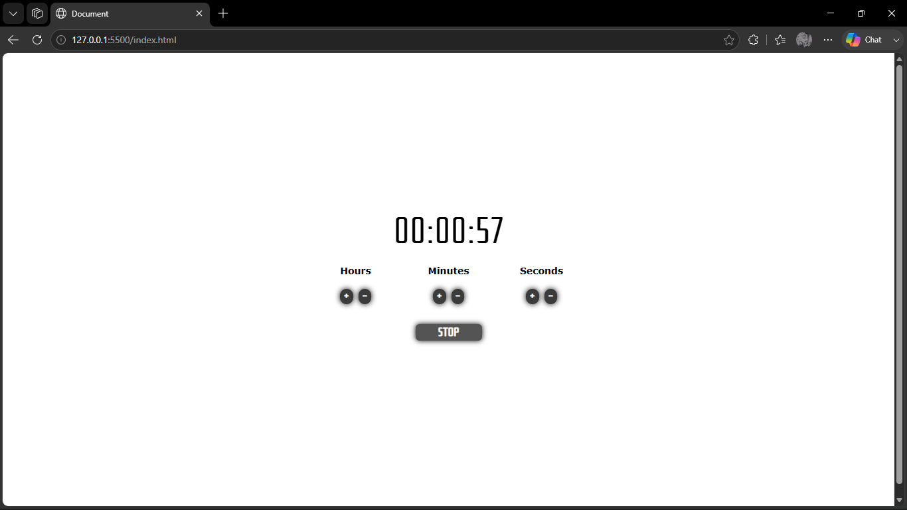

---

## 🖼️ Screenshots
Here’s a preview of the timer interface:

| Default Template | Countdown Active |
|------------------|------------------|
|  |  |

---

## 💡 Setup Instructions
1. Clone the repository:
   ```bash
   git clone https://github.com/<your-username>/Countdown-Timer.git
